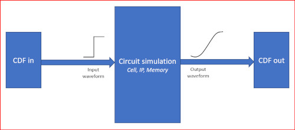

# CDF
**Characterization Description Format**

CDF or characterization description format is effective in capturing properties of VLSI cells and IPS at several levels of abstraction.

1. Functional Level for VLSI cell
1. Logic level stimulus
1. Electrical level stimulus
1. Measurement of models (timing, power etc)

It is a baseline proposal for a standard to act as an interface across VLSI software(s) using and/or interfacting with 
[SPICE simulators](https://en.wikipedia.org/wiki/SPICE).

## CDF in characterization

It is currently being used in characterization softwares for cells, memories, and IPs. 

Table below covers types of currently supported stimulus types.

| No. | Stimululus Types 
| ----|-------------------
| 1.  | delay            
| 2.  | tristate
| 3.  | incap
| 4.  | rcap
| 5.  | ipower
| 6.  | dpower
| 7.  | apower
| 8.  | lpower
| 9.  | maxcap
| 10. | setup
| 11. | hold
| 12. | recovery
| 13. | removal
| 14. | mpw
| 15. | ccsn_vivo
| 16. | ccsn_prop
| 17. | ccsn_volt
| 18. | ccsn_mcap

## Other CDF usage

### CDF in timing verification

### CDF in power analysis

### CDF in noise analysis

### CDF in reliability analysis

###  CDF in timing correlation

### CDF in liberty generation

### CDF in liberty QA
